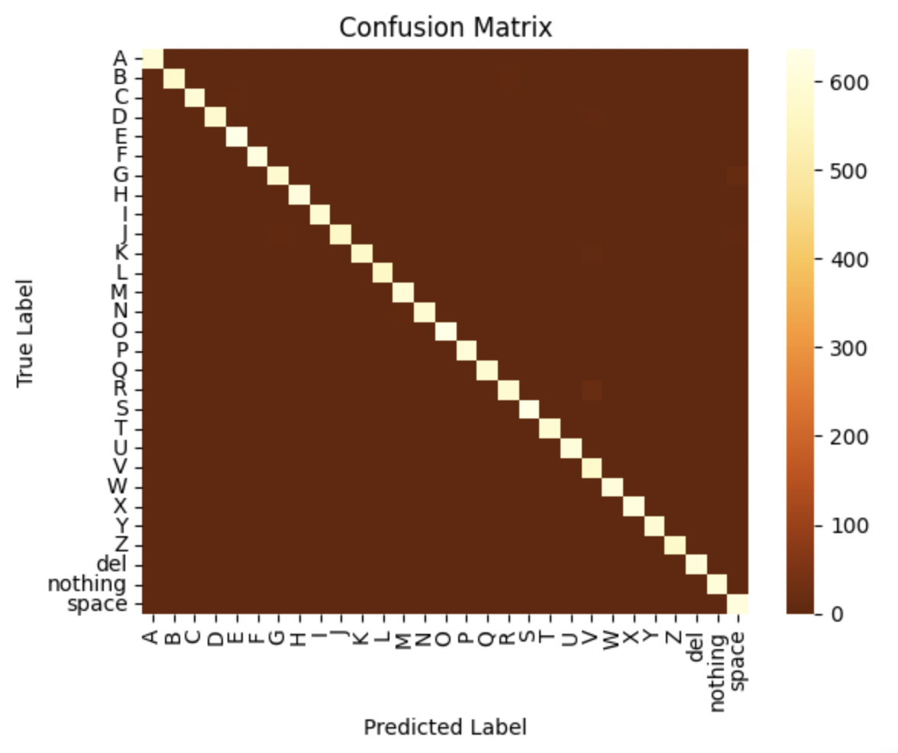

Project by: Spencer Tran | sdtran@usc.edu
<h2>Dataset</h2>
<ul> 
  <li>I chose the <b>ASL dataset</b>, which includes 87,000 <i>200x200x3</i> images with RGB values of [0,255] . </li>
  <li> I used 80% of the images for training and 20% for validation.</li>
  <li> I resized the images to be <i>3x224x224</i>, then divided the values by 255 to load the image in a [0,1] range. Lastly, I normalized the images to a mean of [0.485, 0.456, 0.406] and std of [0.229, 0.224, 0.225].</li>
  <i>The ImageNet1000 dataset that the model was pretrained on was also preprocessed in this manner, and the ASL dataset inputs needed to be of a similar format.</i>
</ul>
<h2>Model Development and Training</h2>
<ul>
  <li>I used a pretrained model to save resources and chose a ResNet model pretrained on ImageNet1000 because the model and dataset are well-known and useful for general applications.</li>
  <li>I opted for ResNet18 (instead of 34 or 50) because I thought a smaller model would be more apt for simple tasks such as this one.</li>
  <li>I froze the weights of the first six layers of the pretrained ResNet18 (157 K / 11.7 M parameters).</li>
  <i>Because the ASL dataset images differ a lot from those of ImageNet1000, I figured that I could only reuse the weights of the first few layers since they are thought of as the general feature extractors.</i>
  <li>For classification, I appended a fully-connected layer at the end to transform ResNet's 1000 ImageNet1000 class outputs into 29 ASL class outputs.</li>
  <li>I chose a standard learning rate of 0.04 and used a module named Pytorch Lightning to execute the training and validation process.</li>
  <li>While training, I log the losses and validation accuracies every 2 epochs. I stopped training after 26 epochs because the validation loss seemed to flat-line.</li>
</ul>
<h2>Model Evaluation/Result</h2>
<ul>
  <li>Validation Data Results (17400 images)</li>
  
  <table>
    <tr>
      <th>Metric</th>
      <th>Value</th> 
    </tr>
    <tr>
      <td>accuracy</td>
      <td>0.995402</td> 
    </tr>
    <tr>
      <td>precision</td>
      <td>0.995492</td> 
    </tr>
    <tr>
      <td>recall</td>
      <td>0.995378</td> 
    </tr>
    <tr>
      <td>f1_score</td>
      <td>0.995389</td> 
    </tr>
    <tr>
      <td>f2_score</td>
      <td>0.995389</td> 
    </tr>
    <tr>
      <td>auc</td>
      <td>0.998769</td> 
    </tr>
  </table>
  <li>Testing Data (28 images) had 100% accuracy</li>
</ul>
<h2>Discussion</h2>
<ul>
  <li>This project can be used to classify hand symbols from other sign languages or a variety of hand gestures, which can improve accessibility for deaf people. For example, it can be used to create captions in videos with sign language.</li>
  <li>Due to the high performance, the ASL dataset, model, and training procedures seem to work well for the task of identifying ASL symbols. However, because the ASL dataset images were so clean and uniform within the different classes, my methods might not be generalizable for data that is not of a similar format.</li>
  <li>My next steps on this project would be to gather more data and to measure the benefits of using data augmentation, such as flipping the images, in order to improve the data's variety.</li>
</ul>
